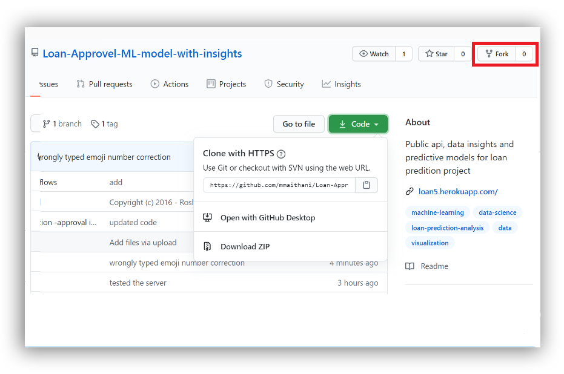
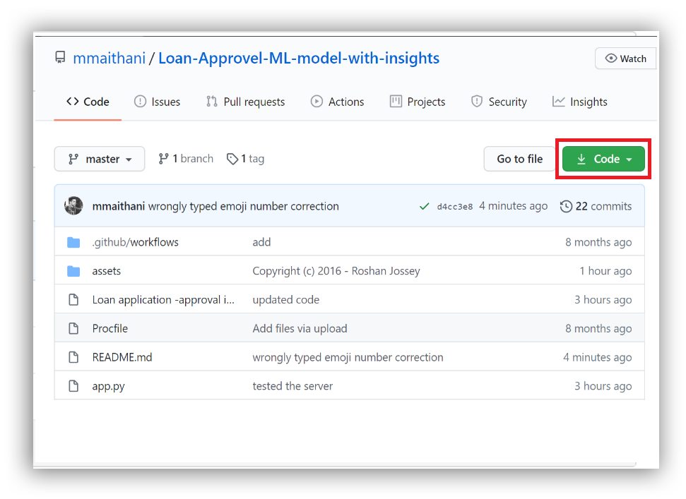
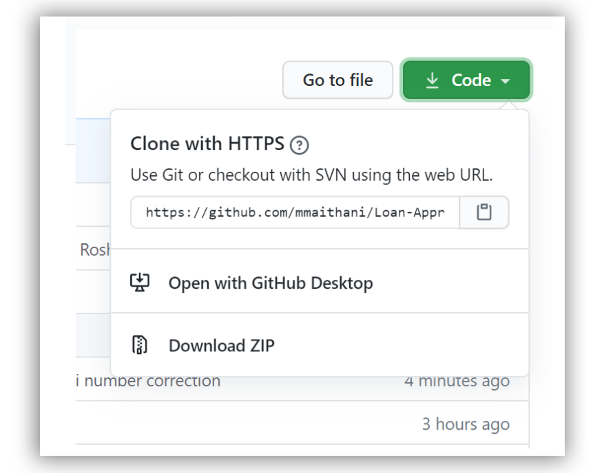

# Loan Approval Predictor


[  ](https://www.linkedin.com/in/mohitmaithani/)
[](https://twitter.com/xaret_)
[](https://github.com/mmaithani/)

[](https://github.com/mmaithani/Loan-Approvel-ML-model-with-insights/)

## 1️⃣ Description

Loan approval is a very important process for banking organizations. The system approved or reject the loan applications.
Recovery of loans is a major contributing parameter in the financial statements of a bank. It is very difficult to predict the possibility of payment of loan by the customer.
In recent years many researchers worked on loan approval prediction systems. Machine Learning (ML)techniques are very useful in predicting outcomes for large amount of data.

## 2️⃣ Key Features

- data insights withhin <a href="https://github.com/mmaithani/Loan-Approvel-ML-model-with-insights/blob/master/Loan%20application%20-approval%20insights%20.ipynb">Jupyter Notebook</a>
- Trained <a href="https://github.com/mmaithani/Loan-Approvel-ML-model-with-insights/blob/master/modell.pkl"> Model </a>
- Public <a href="https://dashboard.heroku.com/apps/loan5/deploy/github"> api </a>
- multiple machine learning algorithms. 

## 3️⃣ Public Api usage

install Requests, 
```sh
# heroku url
heroku_url = 'https://titanic-flask-model.herokuapp.com' # change to your app name

# sample data
data={'Gender':1, 'Married':1, 'Dependents':2, 'Education':0, 'Self_Employed':1,'Credit_History':1,'Property_Area':1, 'Income':1}

data = json.dumps(data)
```
- check prediction
```sh
print(send_request.json())

```
you will get answer
{'results': {'results': 1}}

Now people can access API endpoint with the Heroku URL and use this model to make prediction 

## 4️⃣ Tech Stack

- Heroku
- Scikit-learn
- Flask
- Pandas, numpy


## 5️⃣ Credit

[ ](https://github.com/mmaithani)    [  ](https://www.linkedin.com/in/mohitmaithani/)    [](https://twitter.com/xaret_)    **[Mohit Maithani](https://mmaithani.github.io)**    |  Tech enthusiast (Data Science)

- public api deployment 
[](https://twitter.com/elizabethets)

## 6️⃣ Contributing

```sh
git clone https://github.com/mmaithani/Loan-Approvel-ML-model-with-insights.git 
```
Start rocking

# For beginner here is a full <a href="https://github.com/firstcontributions/first-contributions/blob/master/README.md"> tutorial :</a>



If you don't have git on your machine, [install it]( https://help.github.com/articles/set-up-git/).

## Fork this repository

Fork this repository by clicking on the fork button on the top of this page.
This will create a copy of this repository in your account.

## Clone the repository



Now clone the forked repository to your machine. Go to your GitHub account, open the forked repository, click on the clone button and then click the *copy to clipboard* icon.

Open a terminal and run the following git command:

```
git clone "url you just copied"
```
where "url you just copied" (without the quotation marks) is the url to this repository (your fork of this project). See the previous steps to obtain the url.



For example:
```
git clone https://github.com/this-is-you/first-contributions.git
```
where `this-is-you` is your GitHub username. Here you're copying the contents of the first-contributions repository on GitHub to your computer.

## Create a branch

Change to the repository directory on your computer (if you are not already there):

```
cd first-contributions
```
Now create a branch using the `git checkout` command:
```
git checkout -b <add-your-new-branch-name>
```

For example:
```
git checkout -b add-alonzo-church
```
(The name of the branch does not need to have the word *add* in it, but it's a reasonable thing to include because the purpose of this branch is to add your name to a list.)

## Make necessary changes and commit those changes

Now open `Contributors.md` file in a text editor, add your name to it. Don't add it at the beginning or end of the file. Put it anywhere in between. Now, save the file.


If you go to the project directory and execute the command `git status`, you'll see there are changes.


Add those changes to the branch you just created using the `git add` command:

```
git add Contributors.md
```

Now commit those changes using the `git commit` command:
```
git commit -m "Add <your-name> to Contributors list"
```
replacing `<your-name>` with your name.

## Push changes to GitHub

Push your changes using the command `git push`:
```
git push origin <add-your-branch-name>
```
replacing `<add-your-branch-name>` with the name of the branch you created earlier.

## Submit your changes for review

If you go to your repository on GitHub, you'll see a  `Compare & pull request` button. Click on that button.


Now submit the pull request.


Soon I'll be merging all your changes into the master branch of this project. You will get a notification email once the changes have been merged.

### Next Version

will add interface where i can use the public prediction api

### Attribution

These contribution guidelines have been learned from [this good-Contributing.md-template](https://gist.github.com/PurpleBooth/b24679402957c63ec426).
Also special thanks : 
- elizabethets

<div style="width:100%;height:0;padding-bottom:56%;position:relative;"><iframe src="https://giphy.com/embed/xUA7aQOxkz00lvCAOQ"width="100%"height="100%"style="position:absolute" frameBorder="0" class="giphy-embed" allowFullScreen></iframe></div><p><a href="https://giphy.com/gifs/xUA7aQOxkz00lvCAOQ">via GIPHY</a></p>
